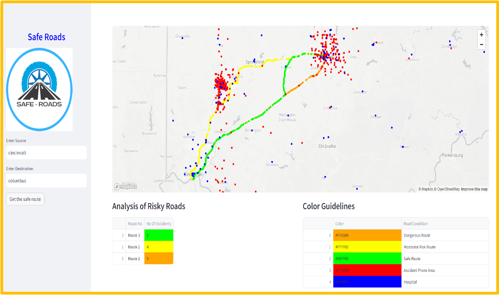
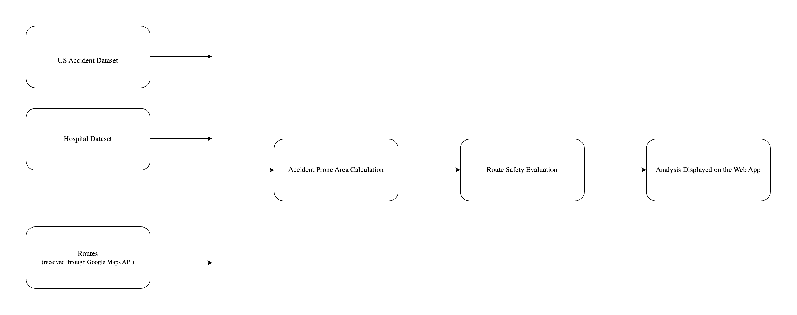

# Safe-Roads: - Your Journey, Your Safety, Your Way

  

Introducing 'Safe-Roads' – your reliable guide to smarter, safer journeys. In a world where road safety matters, we're here to make a difference. We're not about predictions; we're about certainty.

Safe-Roads takes a data-driven approach, comparing Kaggle's accident-prone areas with Google Map routes to determine safety levels. Our innovation lies in accuracy. We're all about matching spots and making informed decisions.

What sets us apart is our unique methodology. We analyze accident data to create a clear hierarchy: dangerous, moderate risk, and safe roads. No predictions, just facts.

Personalization is our strength. Input your origin and destination, and we provide safety recommendations tailored just for you. Join our growing community of responsible drivers, sharing insights and fostering a culture of safety.

With real-time updates, educational resources, and our unwavering commitment to road safety, Safe-Roads empowers you to choose your route wisely. Download Safe-Roads today and make every journey a secure and well-informed one. Safety isn't a prediction; it's a certainty with Safe-Roads.

## Inspiration
When planning a car journey, we often prioritize factors like travel time, traffic, and toll costs, but one critical aspect that tends to be overlooked is road safety. While most navigation apps excel at providing directions and real-time traffic updates, few emphasize the importance of ensuring your safety during the journey.

This is where our application, Safe-Road, steps in to bridge this gap. We offer a distinctive and invaluable feature that places accident prevention at the forefront of your travel experience. Unlike other apps that primarily come into play after an accident has already occurred, Safe-Road is dedicated to proactively preventing accidents from happening in the first place.

Our app provides you with the option to select routes that not only optimize travel efficiency but also prioritize safety. We take your well-being seriously and guide you toward routes with fewer reported accidents. Safe-Road empowers you to make informed decisions and take precautionary steps to avoid accident-prone roads, ensuring your safety is paramount.

With Safe-Road, you can embark on your journey with the confidence that you are actively enhancing your safety on the road. Your security is our top priority, and Safe-Road is here to lead you toward safer and more worry-free travels. By choosing Safe-Road, you're not just saving time and money; you're safeguarding your well-being on the road.

## Key Features

Safe-Roads, which displays accident-prone areas on a route and helps users make informed decisions about safe driving, stands out for several important reasons:

1. **Safety-Focused**: Our project prioritizes road safety, which is a critical issue globally. By providing information on accident-prone areas and safety recommendations, we contribute to making road travel safer for users.

2. **Data-Driven**: Our project relies on data and technology to analyze and present relevant information. This data-driven approach allows users to make well-informed decisions based on real-time or historical accident data.

3. **User Empowerment**: Our project empowers users by providing them with the tools and knowledge to make safer driving choices. It places safety decisions in the hands of the individual driver.

5. **Preventative**: Instead of simply reporting accidents after they've occurred, your project takes a preventative approach. By identifying potential danger zones in advance, users can avoid accidents before they happen.

6. **Awareness**: Our project raises awareness about road safety and the importance of making informed decisions while driving. It encourages users to be proactive about their safety.

7. **Educational**: In addition to suggesting safe routes, Our project can educate users about safe driving practices, road regulations, and how to respond to emergencies, contributing to safer roads overall.

8. **Community Impact**: By reducing the number of accidents and promoting safe driving habits, Our project can have a positive impact on local communities and reduce the burden on emergency services.

In summary, Safe-Roads stands out for its commitment to road safety, data-driven approach, and the potential to empower users to make safer decisions while driving. It has the potential to make a meaningful impact on road safety and the well-being of those who use it.

## Getting Started

Getting started with Safe-Roads is easy. Just enter your source and destination, and we'll guide you to safer routes customized to your journey. Your safety, your way.

## What it does

Discover the capabilities of Safe-Roads:

  

<ol>
<li><b>Safety-Rated Routes:</b> We provide route options evaluated for safety from your source to destination.</li>
<li><b>Accident Spotlights:</b> Easily identify accident-prone areas on the map.</li>
<li><b>Route Safety Assessment:</b> We assess and categorize routes by accident severity level.</li>
<li><b>Hospital Locations:</b> Find nearby hospital locations conveniently marked on the map.</li>
<li><b>Color-Coded Routes:</b> Routes are color-coded to reflect their accident severity levels, ensuring you make informed decisions.</li>
</ol>

## How we built it

  

<ol>
<li>Activated the Google Map API Key.</li>
<li>Created a GitHub repository.</li>
<li>Downloaded US Accident and Hospital datasets from Kaggle.</li>
<li>Set up the Streamlit environment on our local machines.</li>
<li>Integrated Google Map into Streamlit.</li>
<li>Determined Multiple Routes from source to destination.</li>
<li>Retrieved Latitudes and Longitudes for all routes.</li>
<li>Analyzed and accessed Latitude and Longitudes of accidents from the dataset.</li>
<li>Compared Latitude and Longitudes of routes with Accident Latitude and Longitudes from the dataset.</li>
<li>Identified accident locations if Latitude and Longitudes matched.</li>
<li>Calculated the number of accidents that occurred on all routes.</li>
<li>Computed Percentiles (25th, 50th, 75th) of the number of accidents on all routes.</li>
<li>Classified routes as safe (if the number of accidents is less than 25), moderate (if between 25 and 50), or dangerous (if greater than 75).</li>
<li>Colored each route cell according to the percentile value of the number of accidents (Safe route - Green, Moderate route - Yellow, Dangerous Route - Red).</li>
<li>Colored respective routes according to the percentile value of the number of accidents.</li>
<li>Marked all accident spots with Red color bullets.</li>
<li>Extracted data from the US Hospital Locations dataset and accessed the Latitude and Longitudes of hospitals.</li>
<li>Displayed all hospital locations with Blue markers.</li>
</ol>
   
## Challenges we ran into

In our journey with Safe-Roads, we encountered and successfully conquered a range of challenges:

<ol>
<li><b>Google Cloud Account Activation:</b> Overcoming hurdles in activating our Google Cloud account was pivotal in gaining access to crucial resources.</li>
<li><b>Domain Account Activation:</b> We navigated the intricacies of activating our domain account, ensuring a seamless online presence for our project.</li>
<li><b>Google Map Integration:</b> Tackling the complexity of integrating Google Maps into Streamlit required dedication, but we emerged with valuable expertise.</li>
<li><b>Handling Large Datasets:</b> Dealing with large datasets in Streamlit was no small feat, but we optimized our processes to ensure smooth data management.</li>
</ol>
These challenges reinforced our commitment to Safe-Roads and underscored the importance of perseverance and adaptability in problem-solving.

## Key Takeaways
Our journey with Safe-Roads has been a learning experience filled with valuable insights:

<ol>
<li><b>User-Centric Development:</b> Our project's user-centered approach ensures that safety and convenience are at the forefront of our design.</li>
<li><b>Data-Driven Decision-Making:</b> We've harnessed data analytics to make road safety recommendations based on actual accident-prone areas, promoting informed choices.</li>
<li><b>Google Maps Integration:</b> We successfully integrated Google Maps into Streamlit, broadening our technical skills.</li>
<li><b>Versatile Functionalities:</b> We delved into the diverse capabilities of Google Maps within the Streamlit platform, including the use of polylines and more.</li>
<li><b>Collaboration and Innovation:</b> Our experience demonstrates the power of collaboration and innovation in addressing real-world issues and making a positive impact.</li>
</ol>

These takeaways reflect our growth, resilience, and dedication to making road travel safer for everyone.

## What's next for Safe Roads

<ol>
<li><b>Time-Based Safety:</b> Enhancing safety with road suggestions tailored to the time of day.</li>
<li><b>Mobile App Development:</b> Bringing safety on the go with our upcoming mobile app.</li>
<li><b>Personalized Safety:</b> Assessing your driving skills to offer customized road recommendations.</li>
<li><b>Expanded Safety Features:</b> Exploring options like weather alerts and road condition reports for a more comprehensive experience.</li>
</ol>

## Contributing

We welcome contributions from the community! If you'd like to contribute to Safe Roads, please follow these steps:

1. Fork the repository.
2. Create a new branch for your feature: `git checkout -b feature-name`.
3. Make your changes and commit them: `git commit -m 'Add new feature'`.
4. Push your changes to your forked repository: `git push origin feature-name`.
5. Create a pull request, detailing your changes and improvements.

We appreciate your input and assistance in making Safe Roads better!

## Feedback

If you have any feedback, suggestions, or encounter any issues with Safe Roads, please [open an issue](insert-issue-tracker-link). We value your input and are committed to continually improving our service.

---

© 2023 Safe Roads. All rights reserved.

