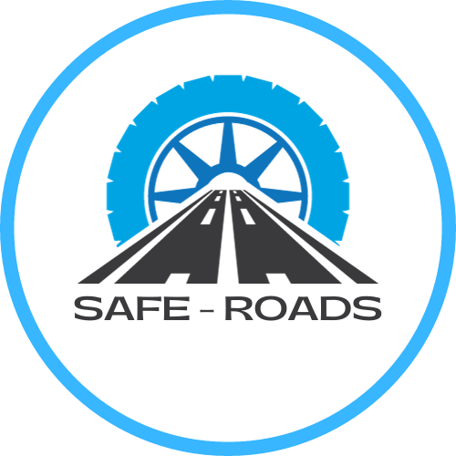

# Safe Roads - Your Beginner Driver's Companion

Safe Roads is a navigation application designed to make driving easier, safer, and more comfortable, especially for beginner drivers. With the "Beginner Driver" feature, it provides routes that prioritize simplicity and safety, avoiding tolls, heavy traffic, accident-prone areas, and pedestrian-congested zones. It's your trusted companion on the road to help you navigate with confidence.

## Key Features

- **Beginner Driver Mode**: Choose routes that are ideal for less experienced drivers, with minimal challenges and distractions.
- **Avoid Tolls**: Save money and stick to toll-free routes, making your journey cost-effective.
- **Safety First**: Drive on roads less prone to accidents and with fewer pedestrians, promoting a safer driving experience.
- **Customization**: Tailor your route preferences based on your comfort level, whether you want simplicity, scenic routes, or a balance between the two.

## Inspiration
When planning a car journey, we often prioritize factors like travel time, traffic, and toll costs, but one critical aspect that tends to be overlooked is road safety. While most navigation apps excel at providing directions and real-time traffic updates, few emphasize the importance of ensuring your safety during the journey.

This is where our application, Safe-Road, steps in to bridge this gap. We offer a distinctive and invaluable feature that places accident prevention at the forefront of your travel experience. Unlike other apps that primarily come into play after an accident has already occurred, Safe-Road is dedicated to proactively preventing accidents from happening in the first place.

Our app provides you with the option to select routes that not only optimize travel efficiency but also prioritize safety. We take your well-being seriously and guide you toward routes with fewer reported accidents. Safe-Road empowers you to make informed decisions and take precautionary steps to avoid accident-prone roads, ensuring your safety is paramount.

With Safe-Road, you can embark on your journey with the confidence that you are actively enhancing your safety on the road. Your security is our top priority, and Safe-Road is here to lead you toward safer and more worry-free travels. By choosing Safe-Road, you're not just saving time and money; you're safeguarding your well-being on the road.

## Getting Started

To get started with Safe Roads, simply [visit our website](insert-your-website-url-here) and sign up for an account. Then, download our mobile app from the [App Store](insert-app-store-link) or [Google Play](insert-google-play-link).

## Contributing

We welcome contributions from the community! If you'd like to contribute to Safe Roads, please follow these steps:

1. Fork the repository.
2. Create a new branch for your feature: `git checkout -b feature-name`.
3. Make your changes and commit them: `git commit -m 'Add new feature'`.
4. Push your changes to your forked repository: `git push origin feature-name`.
5. Create a pull request, detailing your changes and improvements.

We appreciate your input and assistance in making Safe Roads better!

## Feedback

If you have any feedback, suggestions, or encounter any issues with Safe Roads, please [open an issue](insert-issue-tracker-link). We value your input and are committed to continually improving our service.

---

© 2023 Safe Roads. All rights reserved.

[Website](insert-your-website-url-here) | [Contact Us](insert-contact-page-url) | [Privacy Policy](insert-privacy-policy-url) | [Terms of Service](insert-terms-of-service-url)
